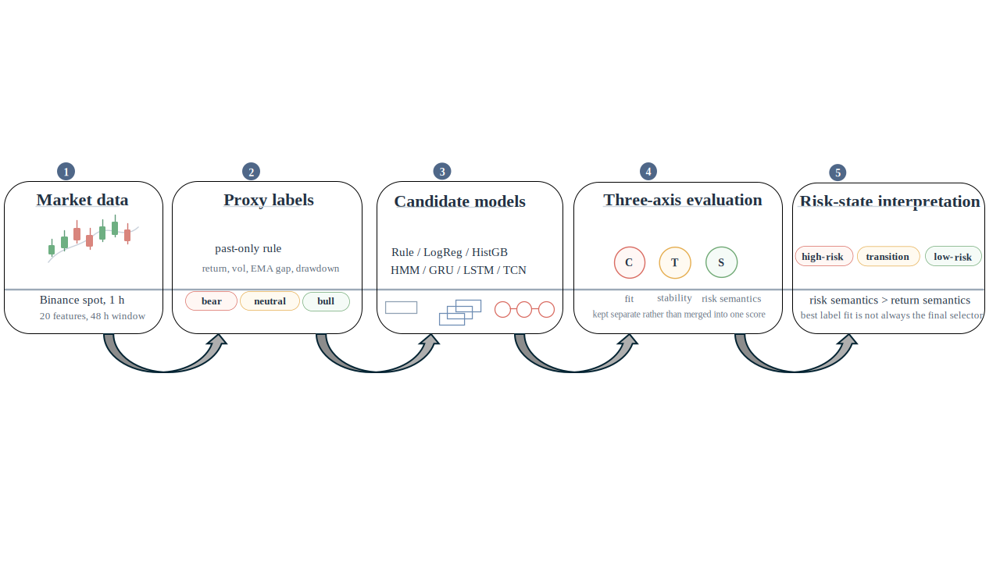

# Weakly Supervised Crypto Risk-State Learning

[](./requirements.txt)
[](./data/README.md)
[](./paper/Manuscript.pdf)
[](https://github.com/llljjjwww333/weakly-supervised-crypto-risk-state-learning)
[](https://github.com/llljjjwww333/weakly-supervised-crypto-risk-state-learning)

Code, configuration, manuscript source, and publication figures for the paper:

**Evaluating Weakly Supervised Cryptocurrency Risk-State Learning: When Label Fit, Stability, and Semantics Disagree**

This repository focuses on the reproducible core of the project:

- data download and validation
- feature engineering and weak-label construction
- baseline and temporal model training
- semantic, stability, and framework-comparison evaluation
- manuscript source and compiled PDF used for the KBS submission draft

It intentionally does **not** include raw market data, processed parquet files, trained checkpoints, or large experiment outputs.



## Repository Layout

```text
configs/        experiment and asset configuration
data/           notes on the expected local data layout
experiments/    note on omitted outputs and how to regenerate them
figures/main/   publication figures used by the manuscript
paper/          LaTeX manuscript source and compiled PDF
scripts/        helper scripts for reruns and figure regeneration
src/            data, feature, model, and evaluation code
requirements.txt
```

## Environment

Recommended:

- Python 3.10+
- `pip install -r requirements.txt`
- LaTeX with `xelatex` if you want to rebuild the manuscript PDF

## Quick Start

### 1. Install dependencies

```bash
pip install -r requirements.txt
```

### 2. Download and validate raw Binance data

```bash
python -m src.data.download_binance_klines --symbols BTCUSDT ETHUSDT BNBUSDT SOLUSDT XRPUSDT --interval 1h --start 2021-01-01 --end 2026-04-20 --out_dir data/raw/spot/1h
python -m src.data.validate_raw_data --input_dir data/raw/spot/1h --interval 1h --report_path data/metadata/raw_validation_report.csv
```

### 3. Build features, weak labels, and windows

```bash
python -m src.features.build_base_table --input_dir data/raw/spot/1h --output_dir data/interim/spot/1h
python -m src.features.make_features --input_dir data/interim/spot/1h --output_dir data/processed/features/1h
python -m src.features.build_labels --input_dir data/processed/features/1h --output_dir data/labels
python -m src.features.build_windows --input_dir data/processed/features/1h --output_dir data/processed/windows/1h --window 48
```

### 4. Run baselines or the main temporal model

```bash
python -m src.models.baselines.run_logreg --input_path data/labels/BTCUSDT_labels.parquet --output_dir experiments/baselines/logreg_btc
python -m src.models.baselines.run_hmm --input_path data/labels/BTCUSDT_labels.parquet --output_dir experiments/baselines/hmm_btc --n_states 3
python -m src.models.main.train_main --input_path data/processed/windows/1h/BTCUSDT_win48.parquet --output_dir experiments/main/gru_btc
```

### 5. Evaluate semantic and stability behavior

```bash
python -m src.evaluation.evaluate_classification --input_path experiments/main/gru_btc/test_predictions.parquet --output_dir experiments/main/gru_btc/eval
python -m src.evaluation.evaluate_stability --input_path experiments/main/gru_btc/test_predictions.parquet --output_path experiments/main/gru_btc/stability.csv
python -m src.evaluation.evaluate_risk_state_semantics
python -m src.evaluation.run_bootstrap_block_sensitivity
```

## Rebuilding the Paper

The manuscript lives in [paper/Manuscript.tex](./paper/Manuscript.tex).

Compile from the `paper/` directory:

```bash
xelatex Manuscript.tex
bibtex Manuscript
xelatex Manuscript.tex
xelatex Manuscript.tex
```

The figure paths are already wired to `../figures/main/`.

## What Is Not Included

- raw Binance downloads
- processed parquet tables
- trained model checkpoints
- large experiment output trees
- submission-only extras such as cover letters and title pages

The repository is intended to stay focused on the code and manuscript needed to understand and reproduce the paper.
